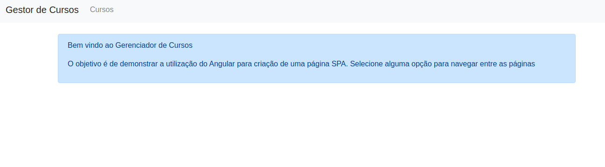
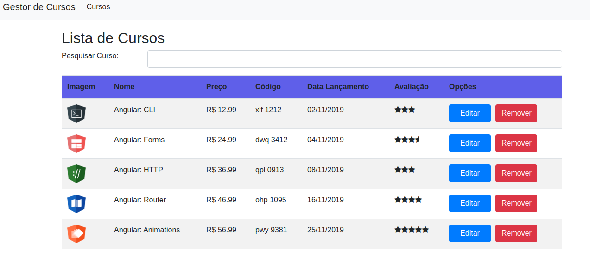
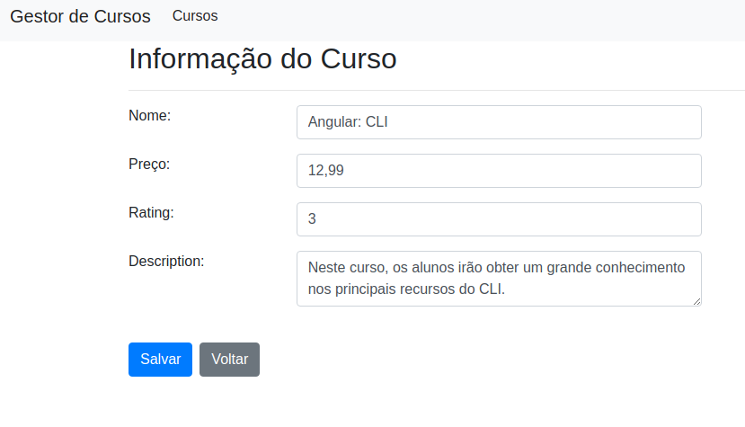
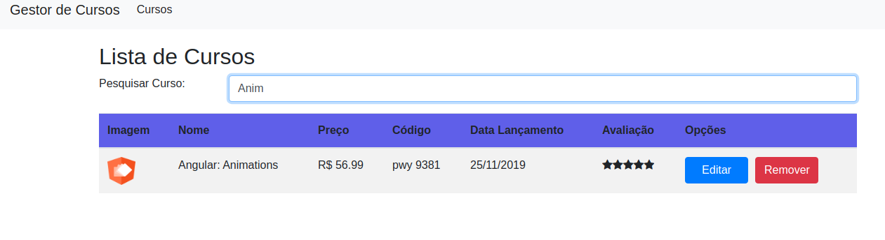

# Gerenciador de Cursos
Uma aplicação CRUD criada com o objetivo de gerenciar cursos, usando Angular versão 11.2.0

## Tecnologias:
- Angular (Material, Forms, Routing, RxJS)
- Javascript
- NodeJS
- TypeScript
- BootStrap
- CSS
- HTML
- ExpressJS

## Imagens

- Tela Principal

- Listagem de Cursos

- Edição do Curso

- Pesquisa do Curso

## Execução - Servidor Web
Digite `npm  install` para baixar as dependências necessárias.
Digite `ng serve`. Acesse a página `http://localhost:4200/`.

## Execução - Servidor Node ExpressJS
Acesse o diretório "server"
Digite `node serve.js` para executar o servidor.
